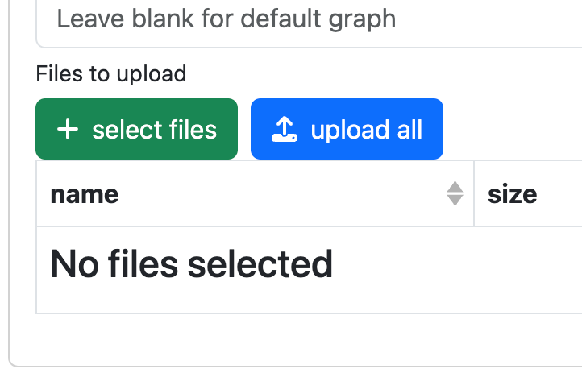

# Movie Recommender App

## Overview

Welcome to our Movie Recommender App! This application leverages advanced artificial intelligence to enhance your movie-watching experience. By utilizing the extensive database provided by The Movie Database (TMDb), our app enables users to easily search for movies they have watched and receive personalized recommendations for their next viewing.

## Key features

### 1. NLP-Driven Movie Search:
Leverage the power of NLP to perform intuitive movie searches using natural language queries.
Connects seamlessly with TMDb, ensuring an up-to-date and extensive movie database.

### 2. Smart Recommendations:
Receive intelligent movie recommendations based on NLP analysis of your viewing history.

## Getting started

### 1. Clone the repository

    git clone https://github.com/JR1der/IAI_Project.git

### 2. Install the requirements

To create a virtual environment run the venv module as a script with the directory path:

    python -m venv .venv

Once you’ve created a virtual environment, you may activate it.

#### On Windows, run:

    .venv\Scripts\activate

#### On Unix or MacOS, run:

    source .venv/bin/activate

#### To install, firstly, activate the environment and after type in:

    pip install -r requirements.txt

### 3. Run fuseki server

In the project folder find apache-jena-fuseki and run the file

    fuseki-server.jar

After enter follow the [link](http://localhost:3030/#/)

    http://localhost:3030/#/

Click **"add data"**

After click select files and select TMDB.ttl from the folder data of our repository.

Upload, and you can continue with the next step

### 4. Run the app

To start run the app.py file

    python3 app.py

### 5. Open the app in the browser

[Follow this link to open the app in the browser](http://127.0.0.1:5000)
